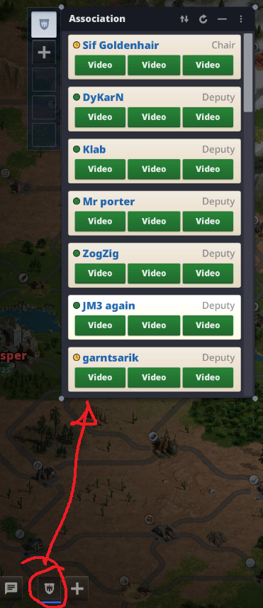
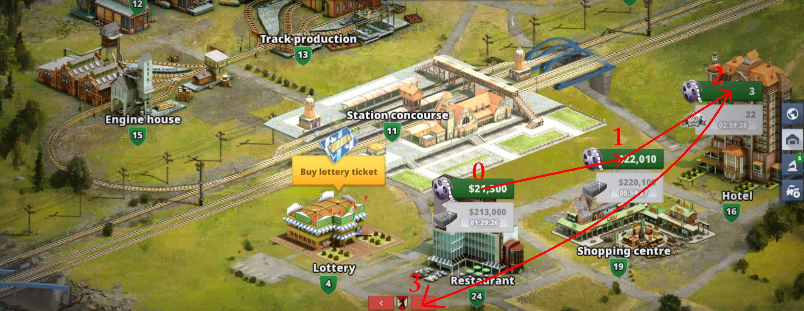

Rail Nation Bot
===

A bot which automatically plays the game [Rail Nation](https://www.rail-nation.com). For the moment it only collect all the bonuses from train station for you and your team, and also it's watching ads.

## Features

  - [x] collect all the bonuses for you & your team
  - [x] watch all the ads for you & your team
  - [x] store rewards (from watching ads) like free money, research points, free tickets
  - [x] stop the program with a key while running, or you can close it manually.
  - [ ] reload page when video it stucks
  - [ ] distribute research points
  - [ ] leveling a building in some priority order.

## Motivation

I started to make this bot, because I found it useful saving time. Let it collecting all the bonuses for you, meanwhile you relax, eat, make a shower, or pray.
In this way you advance in the game, and also have more time for yourself.

## Screenshots

The latest version uses the widget for overall improved speed, and improved performance when a bonus need to be collected, as it jumps to the top of the widget.

In **Screenshot 1** you can see an example of the widget.

And in **Screenshot 2** you can see an example of video (ad), how it's looking.

## Tech/framework used

**Built with**

   * [Python](https://docs.python.org/3/) ( version 3.8.3) running on Windows 7, 64 bit

**Modules used**
   * *os* .......................... -> changing the current folder for using images
   * *time* ..................... -> decreased CPU usage
   * *pyautogui* .......... -> click and collect bonuses. It has the main use on this program.
   * *cv2* and *numpy* -> for image recognition
   * *sys* ....................... -> for stopped the program
   * *pynput* ................... -> pause the program by key pressed
   * *datetime* ................ -> display the started and end time.

## Installation

   1. Put the folder in your name documents or wherever you want.  
Make sure you don't change the name folder `img`, or any image name or file path.

   2. Run [install.py](code/install.py) from the main **code** folder.

## Usage

1. Make sure you are in the main map window, in game, and if you are using chrome you are logged on in the browser. The program it was designed to work for `1920 x 1080` resolution, but it was added an option for calculating if there it's other resolution than default one.

2. Run the program.

3. When meeting a confirmation window of starting, make sure that the browser, is right underneath of that window. The program literally click the buttons.

### Stop the program

For stop it, all you need to do is pressing `esc` key from the keyboard, and within ~ 4 sec, it should display the next message, that the program was stopped by the user. If not, chances are that the script is in within 15 min waiting time, so you can stop the script easily pressing `ctrl + c` from the command window.

Alternatively, you can move the mouse to the top-left corner of your screen, until it stops, as this is the default behaviour of the *pyautogui* module.

## Contributing

Please read [CONTRIBUTING.md](CONTRIBUTING.md) for details about my code of conduit.

## Versioning
All changes can be see at [CHANGELOG.md](CHANGELOG.md)

&ndash; [V2.0](https://github.com/Cristishor201/RailNationBot/releases/tag/V2.0)

&ndash; [V1.1](https://github.com/Cristishor201/RailNationBot/releases/tag/V1.1)

&ndash; [V1.0](https://github.com/Cristishor201/RailNationBot/releases/tag/V1.0) - initial version

## Authors

  * Cristian Florescu  - [Cristishor201](https://github.com/Cristishor201) - initial work

## License

This project is licensed under the **MIT License** - see the [LICENSE.md](LICENSE) file for details.
