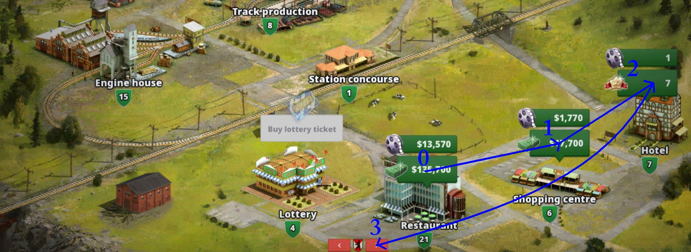
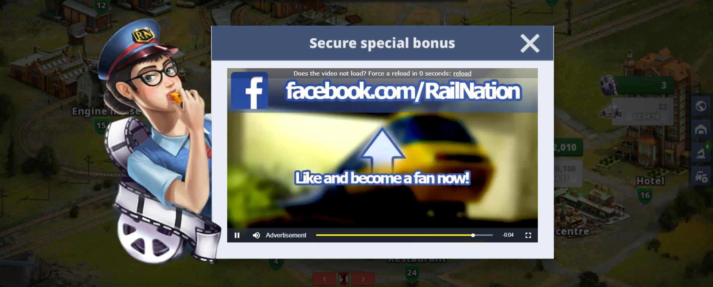

Rail Nation Bot
===

A bot which automatically plays the game [Rail Nation](https://www.rail-nation.com). For the moment it only collect all the bonuses from train station for you and your team, and also it's watching ads for you.

## Features

  - [x] collect all the bonuses for you & your team
  - [x] watch all the ads for you & your team
  - [ ] reload page, when video it stucks
  - [ ] stop it by a hot key, or the stop button

## Motivation

I started to make this bot, because I found it usefull saving time. Let it collecting all the bonuses for you, meanwhile you relax, eat, make a shower, or pray.
In this way you advance in the game, and also have more time for yourself.

## Screenshots

In **Screenshot 1** -> you can see how the code it's working. It collect all bonuses (0-1-2), and then it goes next to your teammates (association), and colect for them too. If you don't know yet, when collecting for others, it triger a chance for winning a lotery ticket, with extra bonuses or other surprises for you.

In **Screenshot 2** -> after collecting all bonuses, it begin watching adds for you (0-1-2), and then for your teammates (3). This would give you more money, and other surprises like research points, but less chance winning a lotery ticket.

And in **Screenshot 3** -> you can see an example of video (ad), how it's looking.

## Tech/framework used

**Built with**

   * [Python](https://docs.python.org/3/) ( verssion 3.7.2) running on Windows 7, 64 bit

**Modules used**
   * *os* .......................... -> changing the curent folder for using images
   * *time* ..................... -> waiting for the train station to load in browser, or the ad to finish.
   * *pyautogui* .......... -> click and collect bonuses. It has the main use on this program.
   * *cv2* and *numpy* -> for a [special searching function](https://github.com/drov0/python-imagesearch), which belong to [Martin Lees](https://github.com/drov0), and it's far away more advanced than that from pyautogui.

## Installation

   1. Put the folder in your name documents or wherever you want.  
Make sure you don't change the name forlder `img`, or any image name.

## Usage

1. Make sure you press the button `Train station` in your middle-right toolbar, and you have full screen of your browser. For now it works only for `1920 x 1080` resolution.

2. Then open the program, and put it on the left side of your window above the browser. Then press F5, or Run/Run module , and then it will firstly mute the sound for you, and then starting to collect ... and at the end, it turn on the sound, back. 

### Issues

If you want to stop it, you need to move the mouse to the top-left corner of your screen, until it stops; or trying to kill it manually.

## Contributing

Please read [CONTRIBUTING.md](CONTRIBUTING.md) for details about my code of conduit.

## Versioning
All changes can be see at [CHANGELOG.md](CHANGELOG.md)

&ndash; [V1.1](https://github.com/Cristishor201/RailNationBot/releases/tag/V1.1)

&ndash; [V1.0](https://github.com/Cristishor201/RailNationBot/releases/tag/V1.0) - initial version

## Authors

  * Cristian Florescu  - [Cristishor201](https://github.com/Cristishor201) - initial work

## License

This project is licensed under the **MIT License** - see the [LICENSE.md](LICENSE) file for details.
